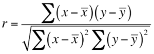
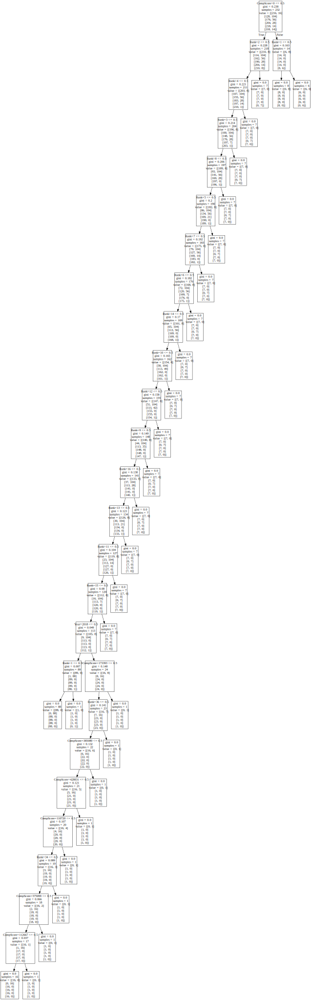

:warning: in review 

:wave: Overall I would like a more robust discussuon about the results, you inroduce several terms but do not describe what they mean in detail or dicuss how they are calcualted. 

# Tetris Score Analysis Server
---
| Zach Levy
| zwlevy@iu.edu
| Indiana University
| hid: sp19-222-97
| github:[:cloud:](https://github.com/cloudmesh-community/sp19-222-97)
| code:[:cloud:](https://github.com/cloudmesh-community/sp19-222-97/tree/master/project-code)

## Abstract
---
Tetris is a popular video game played by many professional and casual players worldwide. Using data recorded from players in from the Tetris World Championship and analyzing the qualities between various factors such as playtime, score, level, and more, the aim is to possibly extract meaningful relationships and evaluate them using standard regression models. The usage of a linear regression model and decision trees are used to explain if any relationships between these exist, and whether said relationships are meaningful. From the extrapolated data, the aim is to use statistical coefficients, such as the correlation coefficent and Gini coefficient from the models to do this.

## Introduction
---
Released originally on the Electronika 60 in the USSR on June 6, 1984, Tetris has came from a small programming project from Soviet game designer Alexey Pajitnov to one of the most world-renowned puzzle video games of all time. 

Although deviations have spawned from the game, the primary rules of Tetris are rather simple. Blocks, arranged into sequences of four called tetrominoes, move vertically from top to bottom. The player can reposition and reorient the blocks, and the goal is to get a set of blocks all on a bottom line, in which the blocks will disappear and add to the score. After many of these occur, the game will speed up, making it harder to arrange blocks correctly. The game is over when the blocks reach to top of the screen.

Ported to a wide variety of platforms, Tetris has become a part of popular video game culture and has sold millions of copies. Psychological studies done on people who play the game have lead to the discovery that people who play for prolonged periods of time may see mild remote memories of the images of the tetrominoes moving [@article:1]. Additionally, some studies suggest that Tetris may help reduce mental stress and help individuals cope with post-traumatic stress disorder [@website:1]. 

## Design
---
The primary design for this project comes in two stages:

1. The creation of a regression model that most suitable fits the dataset. This should most likely be a linear regression model or a data tree.
2. The creation of a RESTful server that could retrieve the raw data sets, perform analysis, and return the data to a requested user.

:wave: numbered list syntax 

The first part of the project required me to program a way to retrieve the transcribed data. Due to the data on the website being only images of spreadsheets rather then the spreadsheets themselves, this was neccessary [@website:2]. By importing the Python libraries csv and requests, the program can retrieve this data from a Google Drive downloadable link as TETRIS_DOWNLOAD.csv. 

By using a decision tree and a linear regression model, we can better understand which relationships between variables are meaningful and which are not. The analysis of the data was first done with the usage of a linear regression model. For this, I took the features to be year, rounds won, and composite score. The label in question was the resulting ranking of players. The second model used was a data tree classifier. This would help with the previous linear regression model, since we can observe how the Gini coefficients - numbers that represent the inequality distribution of data tree nodes that help color the importance of certain variables - are resulted from the usage of a decision tree. Gini coefficients are assigned to each branch and leaf of a decision tree and evaluate the decision inequality when evaluating whether an entry is one or another. If the nodes expectedly go to zero, it is a positve indicator that the model fits well.

## Architecture
---
There are two primary structures within this experiment. The first is the linear regression model located within linear_regressor.py and data_tree.py. The first Python module retrieves data from a Google Drive link and downloads it locally. Using a REST service, it can send over results of analysis on the data set. It gives three distinct graphs, divided into subplots on a single image. 

:wave: see above ordered list syntax 

1) Rank vs. Year
2) Rank vs. Score
3) Rank vs. Rounds Won

As for the second module, data_tree.py, it will simply read the data and create a .dot chart from the results, which can be saved remotely just like the graphs within linear_regressor.py. The Python library graphviz makes for easy use of creating the decision tree to reflect the data used within this experiment.

:wave: your do not need you python file names in this report, instead discuss libraries you used and how you moduliazed your code and created your own python modules. 

## Dataset
---
The data used within this project was primarily extrapolated from data of the winner results from the Tetris World Championships. Due to the fact that previous years represent data as only image screenshots of spreadsheets, the data had to be manually transcribed into other comma-separated value spreadsheets. The data was extrapolated from the spreadsheets into a Google Spreadsheet and saved into a comma-sepearted value file. Extrapolated entries included a player's name, composite score, rank, rounds won, and the year the game took place.

## Results
---
To put the results into better interpration, there are various mathematical ideas that can help explain the actual importance or usefulness of relationships shown. Most importantly when it comes to our experiment is the following for linear regression models and data trees.

* __Correlation Coefficient.__ Denoted by _R_, a correlation coefficient measures the strength of linear relationships of a scatter plot. If _R_ is close to -1, then a strong negative linear relationship exists. Likewise a +1 indicates a strong positive linear relationship. However, if _R_ is closer to zero, then it indicates that a linear relationship isn't very present [@website:3]. _R_ is calculated as follows: 

{#fig:CC-img}

* __Determination Coefficient.__ Denoted by _R^2_, the coefficient of determination how much variation of data has been explained by the model. The closer this value is to one, the better. An _R^2_ that is less then zero indicates that it is a poorly fit model, and the reason this is such is that we have used bad constraints or a made poor choice in model [@lecture:1]. _R^2_ is calculated as follows: 

{#fig:CR-img}

The following table shows various points of data found based on the graphs.

: Linear Regressor {#tbl:lin-reg} 

| Graph Type          | Slope    | Intercept | R Value   | R Squared | P Value  | Standard Error |
|---------------------|----------|-----------|-----------|-----------|----------|----------------|
| Rank vs. Year       | 0.479999 | -950.059  | 0.100040  | 0.010008  | 0.128674 | 0.128674       |
| Rank vs. Score      | -8.47387 | 24.6477   | -0.492092 | 0.242064  | 1.49504  | 0.000009       |
| Rank vs. Rounds Won | -6.92834 | 29.9115   | -0.896032 | 0.802873  | 4.60790  | 0.226367       |

With the correlation coefficients of the graph, most of the relationships we found did not have much importance. As we can tell, the _R_ value of Rank vs. Year was closer to zero, indicating that there is not any strength in a linear relationship with the two statistics. In the 

Moving on, we can discuss the other model used, the decision tree. The decision tree helps us understand the actual meaning of any relationships between variables and whether or not they are of any real importance. The primary way that we evaluate this is by using the following:

* __Gini Coefficient.__ Denoted by it's name, _Gini_, Gini coefficients are used with decision tree algorithms to measure the effectiveness of branches in a data tree. In a good model, we expect these to be closer to zero towards the leaves of a data tree [@lecture:2].

{#fig:data-tree}

:wave: this figure is so big it doesn't really have a place here, maybe a table or a smaller portion would be better.

For the Gini coefficients of the data tree representation, it was found that at the root node that it was precisely 0.238 for a sample size of 232 samples. Moving towards the true side of the graph, we found that Gini coefficients gradualy become closer to zero, with last branching node to only contain a Gini coefficient of 0.037. It should be noted that the data tree node is very lopsided. This could possibly indicate that the cost per each decision is rather high [@lecture:2].

:wave: overal the content in this section is good however a few resources would help streghten this. Additionally you can get in the weeds a bit more about what these values represent and mean. You can even use equations and math to help describe. 

## Conclusion
---
The deductions made from both of these experiments must be approached differently, since they are seperate models. According to the chart, we can see that the _R_ squared value for Rank vs. Year became 0.010008, for Rank vs. Score it was 0.242064, and for Rank vs. Rounds Won it was 0.802873. [@tbl:lin-reg]. This should come as no real suprise, since we expect that any person who won more rounds has a higher rank then the others who did not win. We know that from the rather low values comparatively for Score and Year that there does not seem to be a strong linear relationship between Rank vs. Year and Rank vs. Score.

As for the data tree model, it was discovered that the Gini coefficients for the model were indeed closer to zero but that the data tree itself was heavily lopsided [@fig:data-tree]. This suggests that although their may be vague linear relationship when classifying the elements of the data tree, it has high cost for it's usage, suggesting it may not fit to be a very useful model. The Gini coefficient at the first branch was 0.238, and the Gini coefficient at the last one was 0.37. Pruning of unnessecary leaves, mainly any branches whose Gini coefficients are already zero, could help this matter [@lecture:2].

